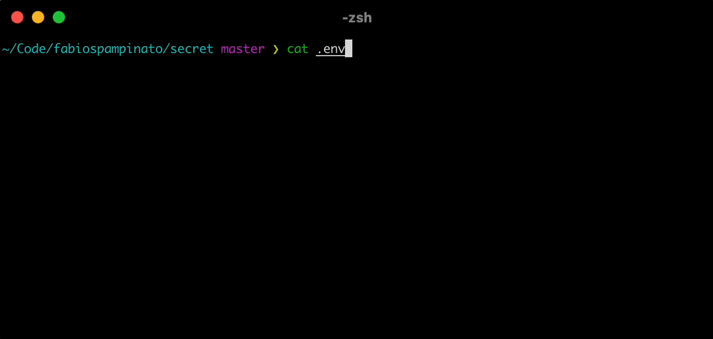

<p align="center">
  
</p>

# Secret

The simplest command to encrypt/decrypt a file, useful for committing encrypted ".env" files to version control, among other things.

Secret automatically detects if you want to encrypt or decrypt a file: if the file ends with the ".secret" extension then it will try to decrypt it, otherwise it will try to encrypt it.

## Install

```sh
npm install -g @fabiospampinato/secret
```

## Usage

Encrypt a file:

```sh
secret myFile.txt
```

Decrypt a file:

```sh
secret myFile.txt.secret
```

## License

MIT © Fabio Spampinato
